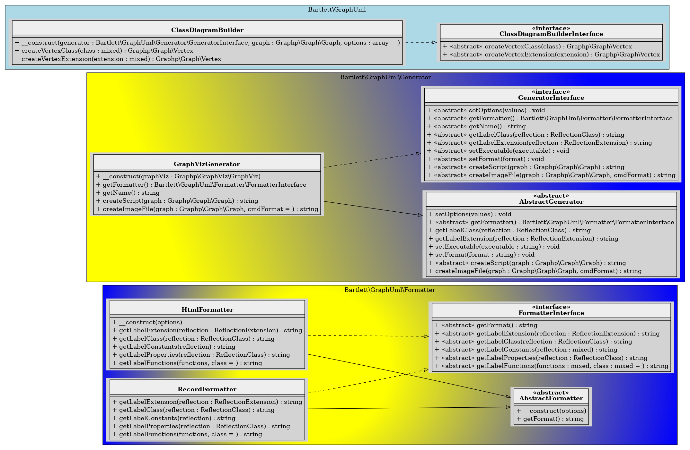

# bartlett/graph-uml

| Stable | Upcoming |
|:------:|:--------:|
| [](https://packagist.org/packages/bartlett/graph-uml) | [](https://packagist.org/packages/bartlett/graph-uml) |
| [](https://php.net/) | [](https://php.net/) |
|  |  |

Generate UML diagrams by reflection for your PHP projects

> Note: This project is in beta stage! Feel free to report any issues you encounter.

## Features

The main features provided by this library are:

* build UML statements of a class diagram
* build image in one of the [supported formats](https://graphviz.gitlab.io/_pages/doc/info/output.html) with local `dot` executable (when **GraphVizGenerator** is used)

## Install

The recommended way to install this library is [through composer](http://getcomposer.org).
If you don't know yet what is composer, have a look [on introduction](http://getcomposer.org/doc/00-intro.md).

```bash
composer require bartlett/graph-uml
```

Additionally, you'll have to install GraphViz (`dot` executable).
Users of Debian/Ubuntu-based distributions may simply invoke:

```bash
$ sudo apt update
$ sudo apt-get install graphviz
```

while remaining users should install from [GraphViz Download](http://www.graphviz.org/download/) page.

## Quick Start

Once [installed](#install), you can use the following code to build UML class diagram for your existing classes:

```php
<?php
use Bartlett\GraphUml;

use Graphp\Graph\Graph;
use Graphp\GraphViz\GraphViz;

$generator = new GraphUml\Generator\GraphVizGenerator(new GraphViz());
$graph = new Graph();
$builder = new GraphUml\ClassDiagramBuilder(
    $generator,
    $graph,
    [
        'label_format' => 'html',
        'show_constants' => false,
        'show_private' => false,
        'show_protected' => false
    ]
);

$builder->createVertexClass(GraphUml\Formatter\HtmlFormatter::class);
$builder->createVertexClass(GraphUml\Formatter\RecordFormatter::class);
$builder->createVertexClass(GraphUml\Generator\GraphVizGenerator::class);
$builder->createVertexClass(GraphUml\ClassDiagramBuilder::class);

// For large graph, orientation is recommended
// https://graphviz.gitlab.io/_pages/doc/info/attrs.html#d:rankdir
$graph->setAttribute($generator->getPrefix() . 'graph.rankdir', 'LR');
// https://graphviz.gitlab.io/_pages/doc/info/attrs.html#d:bgcolor
$graph->setAttribute($generator->getPrefix() . 'graph.bgcolor', 'transparent');
// https://graphviz.gitlab.io/_pages/doc/info/attrs.html#d:fillcolor
$graph->setAttribute($generator->getPrefix() . 'node.fillcolor', 'lightgrey');
// https://graphviz.gitlab.io/_pages/doc/info/attrs.html#d:style
$graph->setAttribute($generator->getPrefix() . 'node.style', 'filled');

// To use this feature, use my fork of graphp/graphviz project (see composer.json)
$graph->setAttribute($generator->getPrefix() . 'cluster.2.graph.bgcolor', 'lightblue');
// Either numeric or class namespace is allowed (2 = Bartlett\GraphUml)
// https://graphviz.gitlab.io/_pages/doc/info/attrs.html#k:colorList
$graph->setAttribute($generator->getPrefix() . 'cluster.Bartlett\\GraphUml\\Generator.graph.style', 'filled');
$graph->setAttribute($generator->getPrefix() . 'cluster.Bartlett\\GraphUml\\Generator.graph.fillcolor', 'yellow:blue');
$graph->setAttribute($generator->getPrefix() . 'cluster.Bartlett\\GraphUml\\Generator.graph.gradientangle', 45);
$graph->setAttribute($generator->getPrefix() . 'cluster.Bartlett\\GraphUml\\Formatter.graph.style', 'radial');
$graph->setAttribute($generator->getPrefix() . 'cluster.Bartlett\\GraphUml\\Formatter.graph.fillcolor', 'yellow:blue');
$graph->setAttribute($generator->getPrefix() . 'cluster.Bartlett\\GraphUml\\Formatter.graph.gradientangle', 180);

// show UML diagram statements
echo $generator->createScript($graph);
// default format is PNG
echo $generator->createImageFile($graph) . ' file generated' . PHP_EOL;
```

That should give such output:



## Documentation

Full documentation is written in MarkDown format, and HTML export is possible with [Daux.io](https://github.com/dauxio/daux.io).
See output results at http://bartlett.laurent-laville.org/graph-uml/ or raw `*.md` files in `docs` folder.

**Table of Contents**

* **Features**
  - [Formatters](docs/01_Features/Formatters.md)
  - [Generators](docs/01_Features/Generators.md)
  - [Options](docs/01_Features/Options.md)

* **Cookbook**
  - [Single Class](docs/02_Cookbook/Single_Class.md)
  - [Multiple Classes](docs/02_Cookbook/Multiple_Classes.md)
  - [PHP Extensions](docs/02_Cookbook/Php_Extensions.md)

## Resources

* https://github.com/llaville/graph-plantuml-generator to draw UML diagrams in [PlantUML](https://plantuml.com/) format.
* http://www.graphviz.org/
* Let's Graphviz it Online https://github.com/dreampuf/GraphvizOnline
* [The Top 55 Graphviz Open Source Projects](https://awesomeopensource.com/projects/graphviz)

## Contributors

* Laurent Laville (Lead Developer)

[](https://sourcerer.io/fame/llaville/llaville/graph-uml/links/0)
[](https://sourcerer.io/fame/llaville/llaville/graph-uml/links/1)
[](https://sourcerer.io/fame/llaville/llaville/graph-uml/links/2)
[](https://sourcerer.io/fame/llaville/llaville/graph-uml/links/3)
[](https://sourcerer.io/fame/llaville/llaville/graph-uml/links/4)
[](https://sourcerer.io/fame/llaville/llaville/graph-uml/links/5)
[](https://sourcerer.io/fame/llaville/llaville/graph-uml/links/6)
[](https://sourcerer.io/fame/llaville/llaville/graph-uml/links/7)

## Credits

This code is a refactored version of [clue/graph-uml](https://github.com/clue/graph-uml) project, licensed under MIT.
